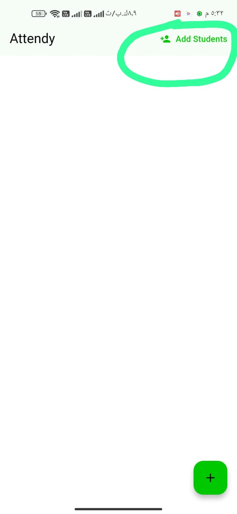
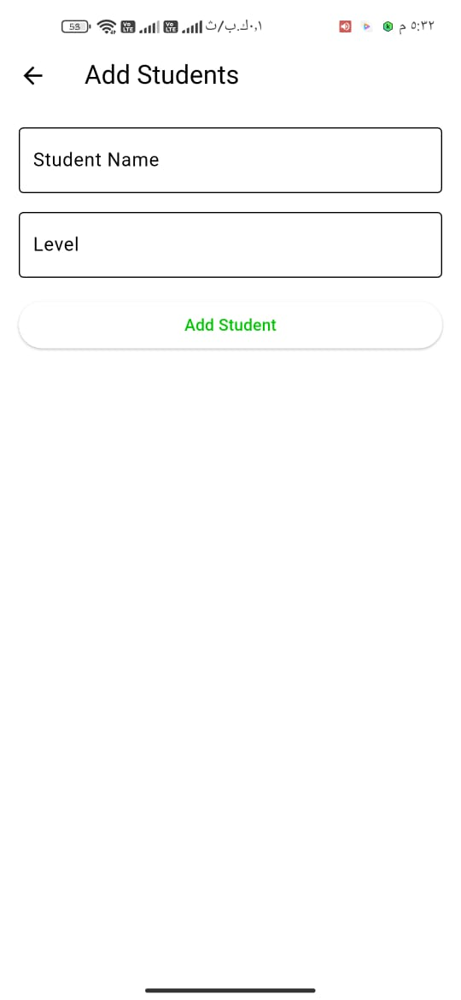
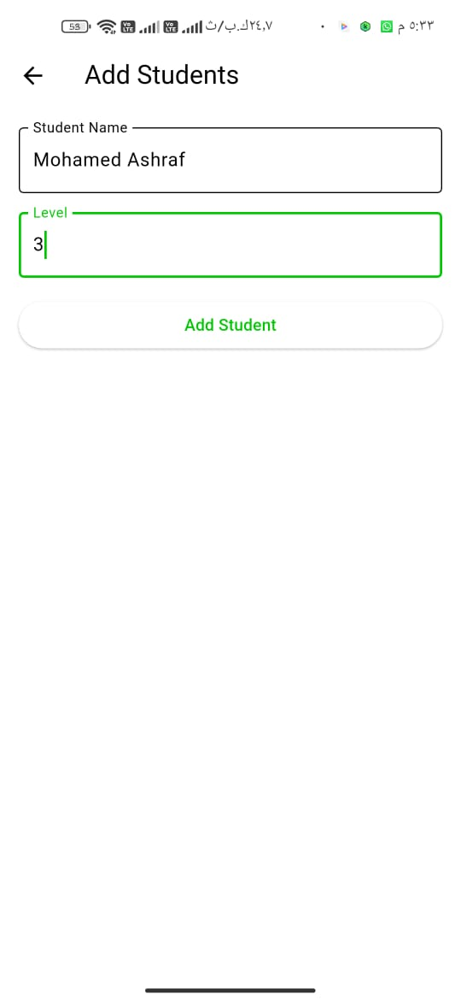
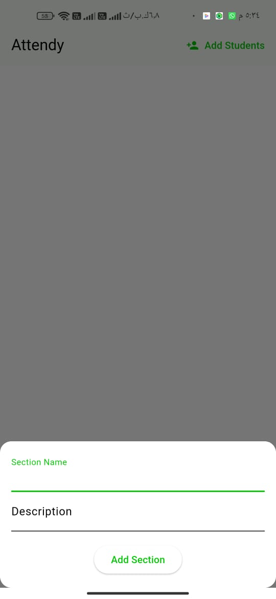
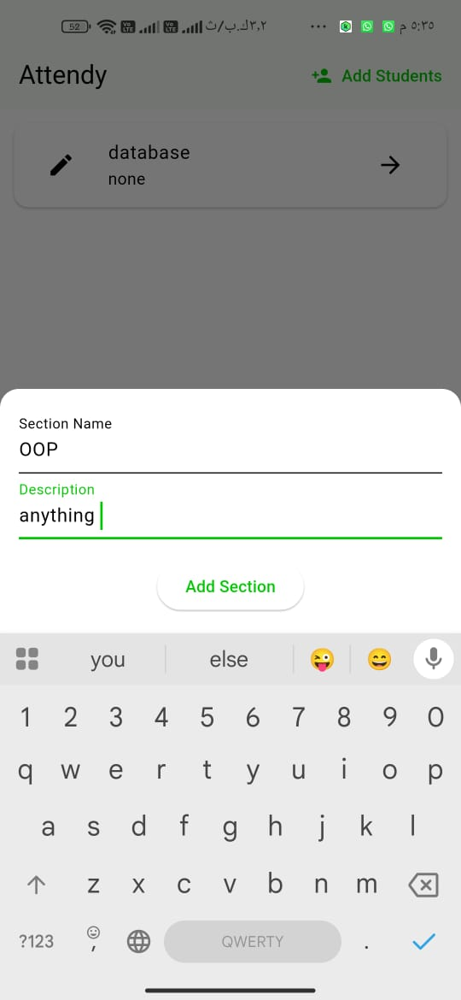
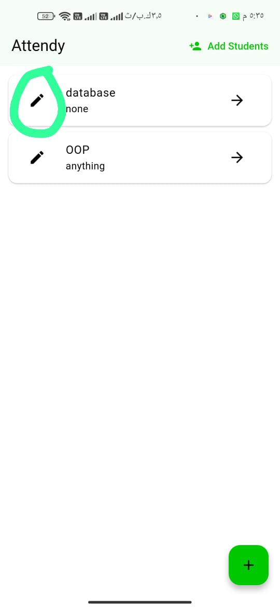
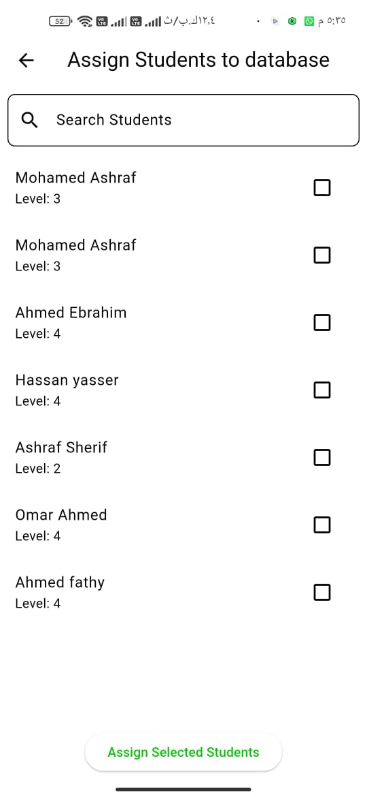
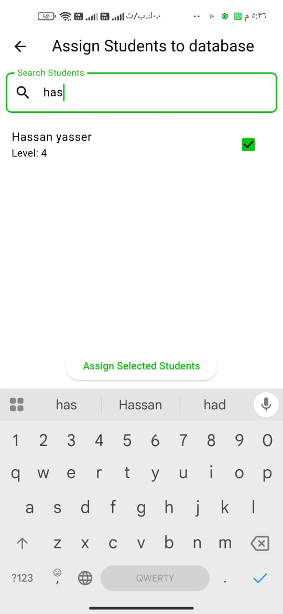
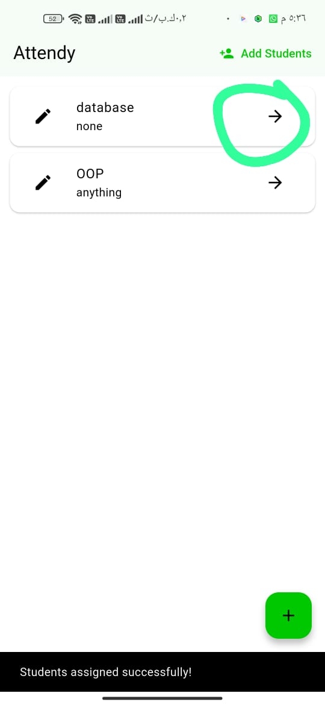
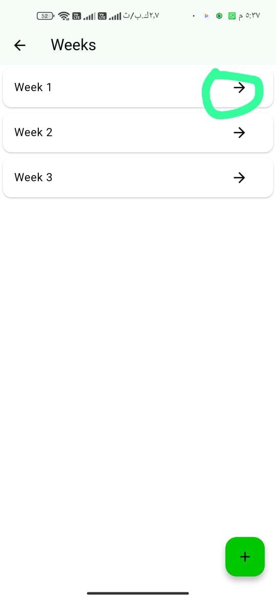

# Attendy - Student Absence Management

Attendy is a **Flutter-based student attendance management app** designed for lecturers. It allows adding students globally and assigning them to specific sections while maintaining attendance records using a **local database (Sqflite)**.

## 📸 Screenshots

## 🚀 Features
- **Add Students Globally**: Register students into the system.
- **Assign Students to Sections**: Manage student assignments per class/section.
- **Attendance Tracking**: Mark student attendance efficiently.
- **Local Database**: Uses **Sqflite** for offline data storage.
- **State Management**: Implements **Cubit (flutter_bloc)** for managing app state.

---
### ⭐ Don't forget to star the repo if you like it!
